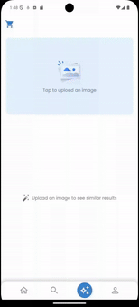

<br><br>

<!-- project philosophy -->


> A mobile app that combines the best of Lebanese clothing into a single, easy-to-use application. By leveraging advanced AI technology, we strive to enhance the shopping experience, foster local businesses, and connect customers with high-quality, unique items from across Lebanon.
>
> Vesti aims to become the leading digital marketplace in Lebanon, offering a seamless shopping experience that brings together a diverse range of products from local stores and artisans. We aim to celebrate and promote Lebanese culture and craftsmanship while providing unparalleled convenience and accessibility to our users.

### User Stories

#### &nbsp; &nbsp; &nbsp; &nbsp; &nbsp; As a User:

- I want to receive automatic notifictions so that i can know if a store nearby is making any discounts.
- I want to be able to upload an image and see similar products of it using ai search engine.
- I want to choose from multiple payment options, including credit card, PayPal, and cash on delivery, so that I can pay in the most convenient way for me.

#### &nbsp; &nbsp; &nbsp; &nbsp; &nbsp; As a Store:

- I want to be able to upload products with image, price, description, colors, and sizes.
- I want to be able to add discounts on products and view active and inactive discounts.
- I want to be able to send notifications to customers informing them of a discount.

<br><br>

<!-- Tech stack -->


### Vesti is built using the following technologies:

- This project uses the [Flutter app development framework](https://flutter.dev/). Flutter is a cross-platform hybrid app development platform which allows us to use a single codebase for apps on mobile, desktop, and the web.
- The app uses a trained model for similarity detection using FAISS, enabling efficient and scallable similarity searches across large datasets.
- For persistent storage (database), the app uses the [Postgre SQL](https://www.postgresql.org/) , the app uses the sequelize ORM package, allowing the app to define custom models and seamlesly store them in a Postgresql database.
- To send automatic notifications, the app uses the [firebase Cloud Messaging](https://firebase.google.com/docs/cloud-messaging/), a service that enables reliable, real-time, and event-driven communication between the app and user's device.
- For the stores web app, the app uses the React Leaflet package, an open-source library for creating interactive maps, while the mobile app integrates flutter_OpenStreetMap to display maps and retrieve the user's location.
- This project is built with ReactJS, a JavaScript library focused on creating dynamic, component-based user interfaces.
- The app uses the font ["Poppins"](https://fonts.google.com/specimen/Poppins) as its main font, and the design of the app adheres to the material design guidelines.

<br><br>

<!-- UI UX -->


> We designed Vesti using wireframes, iterating on the design until we reached the ideal layout for easy navigation and a seamless user experience.

- Project Figma design [figma](https://www.figma.com/design/IV03weUBysFlCVYp1xjnIF/Untitled?node-id=0-1&node-type=canvas&t=afhS00O8y2mSFJD4-0)

### Mockups

|              Create Product screen               |              Create Store screen               |
| :----------------------------------------------: | :--------------------------------------------: |
|  |             |
|                 Discounts Screen                 |               View Store Screen                |
|        |  |

<br><br>

<!-- Database Design -->


### Architecting Data Excellence: Innovative Database Design Strategies:


<br><br>

<!-- Implementation -->


### User Screens (Mobile)

|                       Login screen                       |                              Register screen                               |
| :------------------------------------------------------: | :------------------------------------------------------------------------: |
|       |                        |
|                      Landing screen                      |                            Nearby stores screen                            |
|        |                        |
|                 AI Search Engine screen                  |                          AI Demo Animation Screen                          |
|  |  |
|                      Profile Screen                      |                                Order Screen                                |
|     |                |
|                       Cart Screen                        |                               Payment Screen                               |
|        |                       |

### Stores Screens (Web)

|                                Login screen                                 |
| :-------------------------------------------------------------------------: |
|                                    |
|                                Signup screen                                |
|                                     |
|                               Demo Animation                                |
|  |
|                              Edit Store screen                              |
|                                    |
|                              View Store screen                              |
|                                      |
|                             Add Products Screen                             |
|                                     |
|                              Discounts Screen                               |
|                                      |

<br><br>

<!-- Unit Testing -->


### Precision in Development: Harnessing the Power of Unit Testing:

- This project employs rigorous unit testing methodologies to ensure the reliability and accuracy of code components. By systematically evaluating individual units of the software, we guarantee a robust foundation, identifying and addressing potential issues early in the development process.

<br><br>

<!-- How to run -->


> To set up Coffee Express locally, follow these steps:

### Prerequisites

This is an example of how to list things you need to use the software and how to install them.

- **Node.js**: Latest version
- **Flutter**: Latest version
- **PostgreSQL**: Latest version
- **npm**: Latest version
- npm
  ```sh
  npm install npm@latest -g
  ```

### Installation

_Below is an example of how you can instruct your audience on installing and setting up your app. This template doesn't rely on any external dependencies or services._

1. Clone the repo
   git clone [github](git clone --recurse-submodules https://github.com/hadishamoun1/vesti.git)
2. Set up the backend:

- Navigate to the backend directory:
  ```sh
  cd backend
  ```
- Install NPM packages:

  ```sh
  npm install
  ```

- Create a .env file and enter your database configuration:

  ```sh
  DB_NAME=database
  DB_USER=postgres
  DB_PASSWORD=your_password_here
  DB_HOST=localhost
  PORT=3000
  SECRET_KEY=secret7063
  STRIPE_SECRET_KEY=your_stripe_secret_key_here

  ```
- Initialize the PostgreSQL database:
   ```sh
   node syncDatabase.js

   ```
- Start the backend server:
   ```sh
   node server.js

   ```
- Navigate to the python-services directory and run the FastAPI service:

   ```sh
   cd python-services
   uvicorn main:app --reload

   ```
4. Enter your API in `config.js`
   ```js
   const API_KEY = "ENTER YOUR API";
   ```

Now, you should be able to run Coffee Express locally and explore its features.
